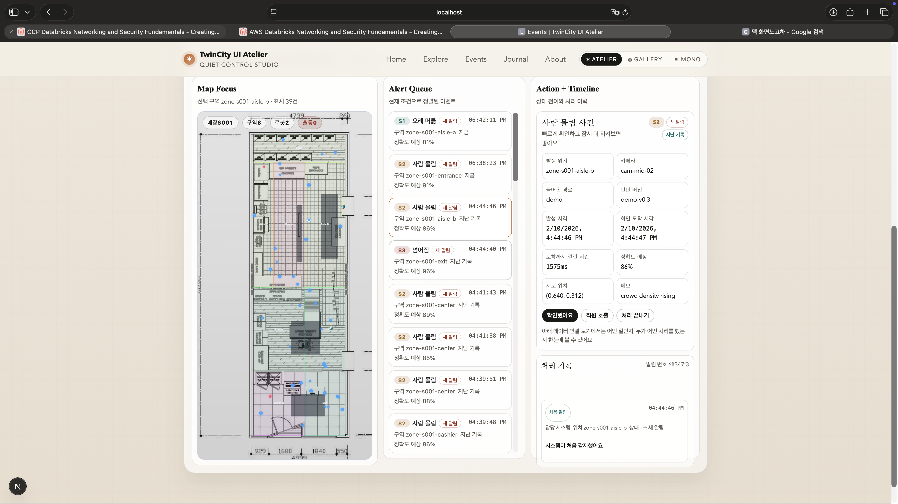

# TwinCity UI — Proof-First Digital Twin Ops Console

TwinCity UI is a Next.js (React/TypeScript) control-tower style operations console. It overlays **zones + events** on a floorplan, then connects that spatial view to the full operator loop:

- ingest posture
- event normalization
- queue triage
- dispatch / resolve timeline
- SLA reporting
- shift handoff / export proof

The important part is not the map by itself. The repo is strongest when read as a **reviewable operator system** that makes `payload -> operator decision -> report/handoff artifact` inspectable without external infrastructure.



## Portfolio posture

- Read this repo like an operator-facing systems repo, not like a graphics or dashboard demo.
- The main proof is deterministic event normalization plus handoff/reporting surfaces that stay reviewable in demo mode.
- In the broader portfolio, this is the clearest bridge from `stage-pilot` reliability work into action-heavy operational software.

## Best target-team fit

| Team lens | What should stand out fast | Start here |
|---|---|---|
| Big tech product / SRE | transport fallback, deterministic contracts, runtime posture before UI polish | `/api/health`, `/api/meta`, `/api/runtime-scorecard`, `tests/runtimeRoutes.test.ts` |
| High-trust operational software | queue triage, shift handoff, evidence-backed operator decisions, explainable workflow state | `/api/reports/handoff`, `/api/reports/dispatch-board`, `/reports` |
| Solution / field architect | review-safe live/demo posture and operating-model clarity | `docs/PORTFOLIO_REVIEW_GUIDE.md`, `docs/LIVE_INTEGRATION.md`, `docs/ops/RUNBOOK.md` |

## Portfolio context

- **Portfolio family:** operator systems, digital twin surfaces, high-trust workflow software
- **This repo's role:** strongest public proof that spatial UX, fallback transport, and handoff/reporting can live in one coherent operator surface
- **Related repos:** `stage-pilot`, `fab-ops-yield-control-tower`, `regulated-case-workbench`

## Big-Tech Elevation Track

- Canonical execution plan: [`docs/BIGTECH_ELEVATION_PLAN.md`](docs/BIGTECH_ELEVATION_PLAN.md)
- Goal: turn this repo into a spatial operations console proof instead of a digital twin UI demo.

## Start here
- **Fastest reviewer guide:** `docs/PORTFOLIO_REVIEW_GUIDE.md`
- **Strongest runtime proof path:** `/api/health -> /api/meta -> /api/runtime-scorecard -> /api/reports/handoff -> /reports -> /events`
- **One-command verification:** `npm run verify`

## Why this repo matters in a portfolio
- **AI / frontier systems signal:** messy provider payloads are normalized into a single operator contract instead of being hand-waved away.
- **Product / systems signal:** runtime posture is inspectable before the reviewer ever touches the UI.
- **Solution architect signal:** dispatch, handoff, export, and ops docs line up into one explainable operating model.
- **Credibility signal:** demo mode is explicit. The repo does not pretend a blank environment is “live production”.

## 2-minute review path

| Step | Open | Why |
| --- | --- | --- |
| 1 | `/api/health` | Confirm whether the repo is demo-first or live-wired and see the review-safe route bundle |
| 2 | `/api/meta` | Read the trust boundary, stage ownership, evidence counts, and proof assets |
| 3 | `/api/runtime-scorecard` | Check ingest posture, export auth posture, and deterministic SLA snapshot |
| 4 | `/api/reports/handoff` | Validate next-shift priorities and overdue queue risk |
| 5 | `/reports` | See the human-readable review pack that matches the route contracts |
| 6 | `/events` | Drop into the actual operator console and timeline flow |

## Role-fit evidence map

### AI / LLM / systems engineer
Look at:
- `src/lib/eventAdapter.ts`
- `tests/eventAdapter.test.ts`
- `/api/reports/summary`
- `/api/schema/report`

This shows the strongest engineering signal in the repo: provider payload variability is normalized into a deterministic, reviewer-safe operator/report contract.

### Product / systems engineer
Look at:
- `/api/health`
- `/api/meta`
- `/api/runtime-brief`
- `/api/runtime-scorecard`
- `tests/runtimeRoutes.test.ts`

This shows that runtime posture, trust boundary, and review flow are explicit instead of buried in the UI.

### Solution architect / field architect
Look at:
- `/api/reports/dispatch-board`
- `/api/reports/handoff`
- `/api/reports/export`
- `/reports`
- `docs/LIVE_INTEGRATION.md`
- `docs/ops/RUNBOOK.md`

This shows the repo as an explainable operating model, not just a UI demo.

## What I owned (team project)
- End-to-end operator UX: live/history views, filters, detail panel, action timeline, settings, and list ↔ map ↔ detail sync
- Reliability work: WS → SSE → HTTP polling fallback, connection state + auto-retry, demo-first mock feeds + replay
- Normalization layer: inconsistent provider payloads -> one `EventItem` schema
- Spatial mapping: percent/world/bbox -> normalized `0..1`, optional camera homography, and snap-to-walkable zones
- Reporting surfaces: SLA summary, dispatch board, shift handoff, export-friendly review routes

## Runtime vs review surfaces
- **Primary runtime:** `/events`, `/reports`, and `src/app/api/*`
- **Primary review contracts:** `/api/health`, `/api/meta`, `/api/runtime-brief`, `/api/runtime-scorecard`, `/api/reports/*`
- **Repo-side proof:** `docs/PORTFOLIO_REVIEW_GUIDE.md`, `docs/LIVE_INTEGRATION.md`, `docs/ops/RUNBOOK.md`, tests, screenshot assets

## Quickstart
```bash
npm ci
npm run dev
```

Open `http://127.0.0.1:3000/events`.

## Verification
```bash
npm run test:proof
npm run verify
```

`npm run verify` runs lint, typecheck, tests, and build.

## Current demo scope
- Demo-first reviewability with no backend required
- Operator workflow: list/map selection sync, timeline actions, local state restore, keyboard navigation
- Shift handoff workflow: deterministic next-shift digest, overdue queue posture, copy-ready handoff brief
- Payload normalization: multiple provider shapes -> one `EventItem` schema
- Coordinate mapping + snapping: percent/world/bbox -> normalized points on valid floor space
- CI/review hygiene: lint, typecheck, test, build, review gate scripts, runbook, postmortem template

## Live sources (optional)
Create `.env.local` from `.env.local.example` and set one or more:

```bash
# Priority: WS -> SSE -> HTTP polling
NEXT_PUBLIC_EVENT_WS_URL=wss://example.com/events
NEXT_PUBLIC_EVENT_STREAM_URL=https://example.com/events/stream
NEXT_PUBLIC_EVENT_API_URL=https://example.com/events
NEXT_PUBLIC_EVENT_POLL_MS=5000

# Community integrations (optional)
NEXT_PUBLIC_FORMSPREE_ENDPOINT=https://formspree.io/f/xxxxxx
NEXT_PUBLIC_DISQUS_SHORTNAME=your-shortname
NEXT_PUBLIC_DISQUS_IDENTIFIER=twincity-about
NEXT_PUBLIC_GISCUS_REPO=owner/repo
NEXT_PUBLIC_GISCUS_REPO_ID=R_kgxxxx
NEXT_PUBLIC_GISCUS_CATEGORY=General
NEXT_PUBLIC_GISCUS_CATEGORY_ID=DIC_kwxxxx

# AdSense (optional)
NEXT_PUBLIC_ADSENSE_CLIENT=ca-pub-xxxxxxxxxxxxxxxx
NEXT_PUBLIC_ADSENSE_SLOT=1234567890
```

If nothing is configured, the app stays honest and reviewable in demo mode.

## Local mock endpoints
- `GET /api/mock/events?shape=a&count=4`
- `GET /api/mock/events?shape=b&count=4`
- `GET /api/mock/events?shape=single`
- `GET /api/mock/events?shape=edge&count=4`

## Key routes
- `/events` — main operator console
- `/reports` — SLA, dispatch, handoff, export-oriented review pack
- `/api/health` — ingest mode + readiness links
- `/api/meta` — trust boundary + evidence bundle
- `/api/runtime-brief` — review-first control tower contract
- `/api/runtime-scorecard` — ingest posture + export governance + SLA snapshot
- `/api/schema/report` — report/export schema
- `/api/reports/summary` — deterministic SLA + spotlight summary
- `/api/reports/dispatch-board` — attention / dispatch / resolved queue snapshot
- `/api/reports/handoff` — next-shift digest + overdue queue risk
- `/api/reports/export` — server-generated JSON / CSV report snapshots

## Docs and supporting artifacts
- `docs/PORTFOLIO_REVIEW_GUIDE.md` — fastest reviewer entry point
- `docs/LIVE_INTEGRATION.md` — payload examples + transport fallbacks
- `docs/ops/RUNBOOK.md` — operator/release guidance
- `docs/ops/POSTMORTEM_TEMPLATE.md` — incident follow-up template
- `tests/runtimeRoutes.test.ts` — route contract verification
- `tests/landingPage.test.ts` — front-door proof-copy regression coverage
- `public/screenshots/ops_console.png` — operator UI proof asset

## Honest limits
- Demo mode does **not** prove auth, backpressure handling, or central persistence.
- Reports summarize browser-local state, not a central incident store.
- 3D probe routes are review/probe surfaces, not a production rendering claim.

## Next
- Expand reports beyond handoff + replay into deeper aggregation
- Add more adapters for edge-device / VLM payload variants
- Improve calibration tooling for camera homography

## Repository hygiene
- Keep runtime artifacts out of commits (`.codex_runs/`, cache folders, temporary venvs)
- Prefer `npm run verify` before opening a PR
- Keep claims route-backed and evidence-backed
