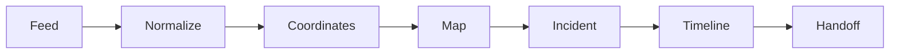

# TwinCity UI

A spatial operations console that turns mixed event feeds into map positions, incident decisions, timelines and handoff records.

**Spatial interfaces · resilient event ingestion · operator state**

[Preview](https://twincity-ui.pages.dev) · [Verification and design](docs/VERIFICATION.md) · [CI](https://github.com/KIM3310/twincity-ui/actions) · [Detailed setup](REFERENCE.md)


```mermaid
flowchart LR
    Feed --> Normalize --> Coordinates --> Map
    Map --> Incident
    Incident --> Timeline
    Timeline --> Handoff
```

## Inspect the implementation

| Source | What it demonstrates |
|---|---|
| [src/lib/liveFeed.ts](src/lib/liveFeed.ts) | WebSocket → SSE → HTTP fallback, cancellation and late-response fencing |
| [src/lib/coordinateTransform.ts](src/lib/coordinateTransform.ts) | World and image coordinate transforms |
| [src/components/site/OpsExperience.tsx](src/components/site/OpsExperience.tsx) | Production incident state and operator actions |
| [src/components/MapView.tsx](src/components/MapView.tsx) | 2D/3D event selection using the same data |
| [tests/liveFeedHttp.test.ts](tests/liveFeedHttp.test.ts) | Real local HTTP recovery from a refused WebSocket upgrade |

## Run it

```sh
npm ci
npm run verify
npm run dev:preview
```

## Evidence

157 tests passed, including transport failure, stale callback rejection, slow-poll ownership and real HTTP recovery. Both the Next.js app and a static interactive preview build from the same console components.

## Scope

The public preview uses synthetic events and checked-in spatial assets. It has no external event source or server-side report API. Source links explain server-only routes. The streaming failure test injects SSE unavailability; it is not a deployed SSE integration or a production reliability measurement.

## Further reading

[Architecture](docs/cloud-ai-architecture.md) · [Architecture manifest](docs/architecture/blueprint.json) · [Architecture validator](scripts/validate_architecture_blueprint.py) · [Original reference](REFERENCE.md)
