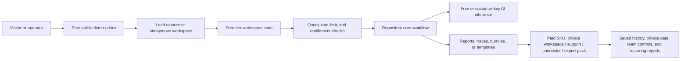

# Revenue Architecture - twincity-ui

This document turns the repository architecture into a zero-to-low-cost service path. It is not a revenue guarantee; it defines the product boundary, free-tier launch stack, metering hooks, and upgrade path needed to test willingness to pay before taking on fixed infrastructure cost.

## Productized Offer

| Layer | Decision |
| --- | --- |
| Target buyer / user | facility operator, smart-city team, or industrial operations lead needing visual scenario playback |
| Productized offer | digital twin operations console with replay, dispatch, readiness, and report surfaces |
| First paid SKU | paid workspace for private maps, event ingestion, and monthly readiness reports |
| Free lead magnet | public demo with synthetic city/facility events |
| Paid expansion | per-site workspace, event ingestion connector, and export/report subscription |
| Data / workflow moat | spatial event model, replay timelines, dispatch annotations, and operational readiness history |

## Free-Tier-First Launch Stack

| Concern | Default choice |
| --- | --- |
| Build and coding loop | OpenCode, Kimi Code CLI, Freebuff, Lovable, Ollama-assisted local agents |
| Public front door | Cloudflare Pages first, with Vercel/Netlify as alternate static front doors |
| Backend / state | Cloudflare Workers for thin APIs, Supabase/Firebase for managed auth and data, Render/Oracle/GCP free VM only when a long-running process is unavoidable |
| AI inference | OpenRouter, Groq, Cerebras, Cloudflare Workers AI, NVIDIA NIM, Ollama local fallback |
| Storage / exports | Supabase Storage, Firebase Storage, Cloudflare R2/KV/D1 depending on data shape |
| Repo-specific launch path | Cloudflare Pages/Next static export where possible, Workers event API, D1/KV event state, R2 replay/report exports, OpenRouter/Groq for summary generation |

Keep exact provider quotas out of the product contract. Free-tier limits change; the architecture should degrade gracefully through caching, daily quotas, customer-supplied API keys, and an explicit paid workspace switch.

## System Shape

## Metering And Paywall Hooks

- Start with anonymous read-only demos and synthetic data so traffic costs stay near zero.
- Add `workspace_id`, `plan`, `quota_day`, and `export_count` fields before adding payment; this lets the app enforce limits without redesign.
- Cache AI outputs by normalized prompt, scenario, model, and version. Paid users can bypass cache with their own provider key.
- Keep exports, private connectors, longer retention, branded reports, team seats, and SLA support behind the paid boundary.
- Store only the minimum data needed for the free tier. Push private/customer data into local runtime or customer-owned accounts whenever possible.

## 30-Day Revenue Test

1. Publish the public demo or architecture page with one clear CTA: request private workspace, download a pack, or run a sample report.
2. Add a lead capture route using Workers + D1/KV, Supabase, Firebase, or a GitHub issue form.
3. Create one downloadable artifact: report PDF, template pack, runbook, dataset sample, or export bundle.
4. Offer a fixed-scope paid package before building subscription complexity.
5. Track activation manually first: visits, CTA clicks, export requests, email replies, and paid pilot conversations.

## Cost Guardrails

- Prefer static pages, edge functions, and scheduled jobs over always-on servers.
- Use OpenRouter/Groq/Cerebras/Workers AI free models only for bounded tasks; require customer keys for heavy/private workloads.
- Use R2 or repo artifacts for large downloads instead of database blobs.
- Keep synthetic sample data in the public demo and reserve customer data for private/local deployment.
- Move to paid infrastructure only when one paid SKU repeatedly exceeds free-tier limits.

## Paid Conversion Architecture

The paid version should not be a different product. It should unlock more trust, privacy, retention, and operational surface area:

- private workspace or local deployment
- saved history and longer retention
- branded exports or signed evidence bundles
- connector setup for the customer's systems
- team roles, audit logs, and admin controls
- support or implementation package tied to a concrete outcome
