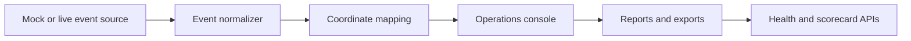

# Technical Review Pack

## System Boundary

TwinCity UI is a spatial operations console with deterministic mock data and optional live ingest. The repository demonstrates route contracts, event normalization, spatial mapping, and reporting surfaces without requiring a live feed.

## Architecture Notes



The transport chain supports WebSocket, server-sent events, and polling. The console still works when all live endpoints are absent.

## Demo Path

```bash
npm ci
npm run test:proof
npm run verify
```

Useful entry points:

- `app/events/page.tsx`
- `app/api/runtime-scorecard/route.ts`
- `tests/runtimeRoutes.test.ts`
- `tests/coordinateTransform.test.ts`
- `tools/exercise_runtime.mjs`

## Validation Evidence

- Tests cover route contracts, event adapters, coordinate transforms, labels, mock routes, runtime metadata, and service metadata.
- Build and type checks run in `npm run verify`.
- Mock data keeps the demo deterministic.

## Threat Model

| Risk | Control |
|---|---|
| Inconsistent provider payload | event normalization tests |
| Broken spatial mapping | coordinate and homography tests |
| Live feed outage | mock mode and transport fallback |
| Export drift | report route contract tests |

## Maintenance Notes

- Keep mock mode complete enough to exercise the full UI.
- Add tests before changing event shape or coordinate math.
- Prefer route-level contracts for reporting endpoints.
- Keep live source configuration optional.
